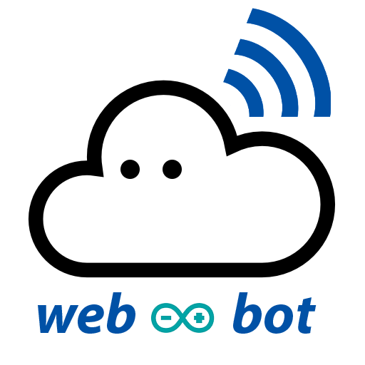

# webOBot
## Home Automation with Arduino & JS

This is my thesis project for completing the Electronic Engineering studies in the Technological Educational Institute of Central Greece.

The fundamental idea behind this project was to built a system for home automation, monitoring and interaction with ones home environment remotely.

### Abstract
It is a fact that in recent years, automation and more specific applications in industry, at home, in the workplace, multiply and grow. Through the internet many automations provide the possibility for remote control, which is combined with the economic materials and thus constantly creating new web automation applications.
The purpose of the project is to create an automated web system that finds application in the home and provide remote control of systems associated with it.
The system consists of an Arduino board, to which an ultrasound sensor, a motion, a temperature, a photoresist, and a button, a LED and a servo are connected.
The Arduino is connected via serial with the computer, who plays the role of parent as in parent - child architecture, Arduino gives measurements, and accepts commands only when requested by the computer - server.
The measurements are recorded in a database, providing the user the ability to look older measurements inside a period of time.
For the interaction of the user and the application, a browser is used, where orders are given and measurements are presented in graphs.
In this thesis, there is the analysis of the connections and the hardware structure, software and communication of each system to the other.

The stack consists of: 

### Arduino platform 
Using the Arduino platform which is cheap and easy to prototype and test out different circuits, with a variety of sensors and components for data acquisition and control. 
The sensors used in this project were:  
